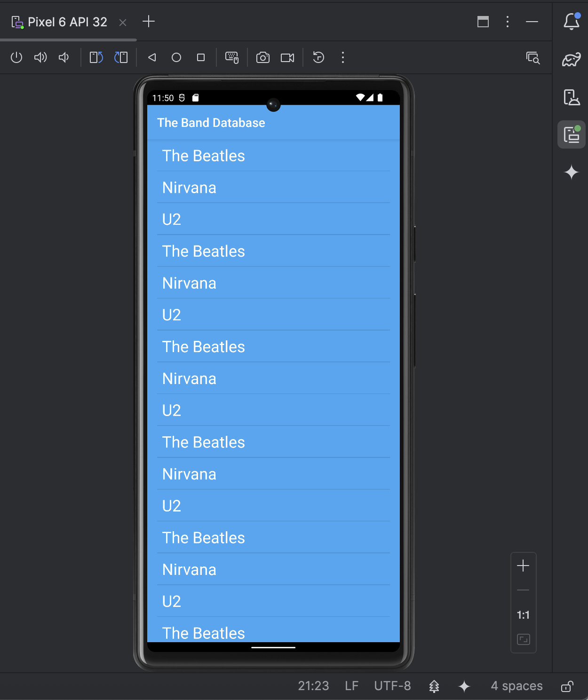
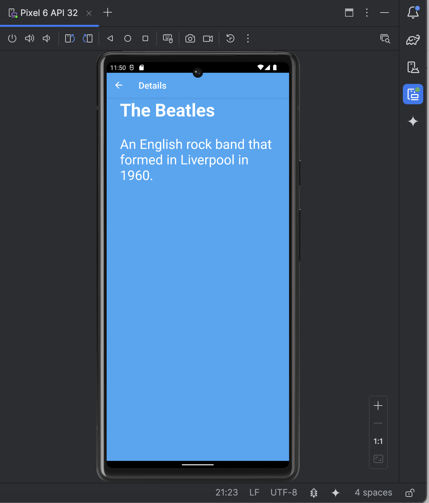
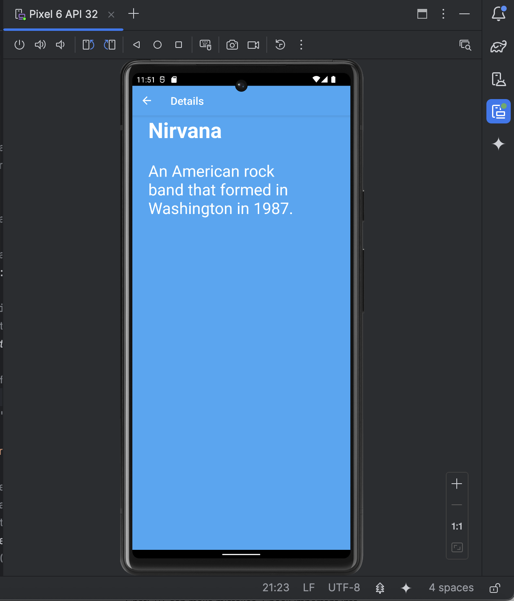

# 🎵 The Band Database App

The Band Database is a simple Android application that displays a list of music bands and opens a detail screen for the selected band. Each detail page includes the band’s name and a short description.  
The app uses a clean **MVC-style structure**, includes **RecyclerView** scrolling, and supports basic navigation with a built-in **app bar back button**.

---

## ✨ Features

- 📱 **Main Screen** with a scrollable list of bands  
- 📄 **Detail Screen** showing the band's name + description  
- ↩️ **Back Navigation** using the app bar  
- 🔄 **RecyclerView Support** for long band lists  
- 🧩 **Simple MVC structure** (Model–View–Controller)  

---

## 🧱 Architecture Overview (MVC)

- **Model:**  
  Band names + descriptions stored in string arrays.

- **View:**  
  XML layouts for the main list and detail screen.

- **Controller:**  
  Activities that handle list item clicks and navigation.

---

## 🖼️ Screenshots

### 1. Main Screen

### 2. Details — The Beatles

### 3. Details — Nirvana

---

## 🚀 How It Works

- The main screen displays a list of band names using **RecyclerView**.
- When the user taps a band, the app opens the detail screen with:
  - A back arrow
  - Band name
  - Description text
- The UI remains clean and simple to demonstrate basic navigation and layout structure.

---

## 📦 Technologies Used

- Kotlin  
- Android Studio  
- RecyclerView  
- Intents & Activities  
- App Bar Navigation  

---
